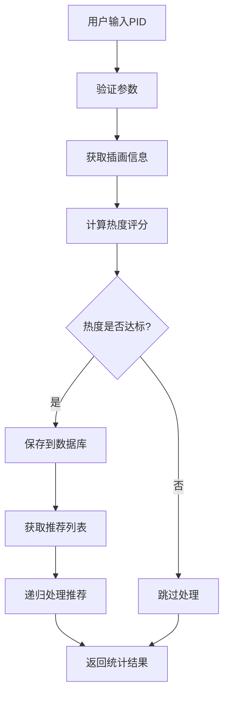
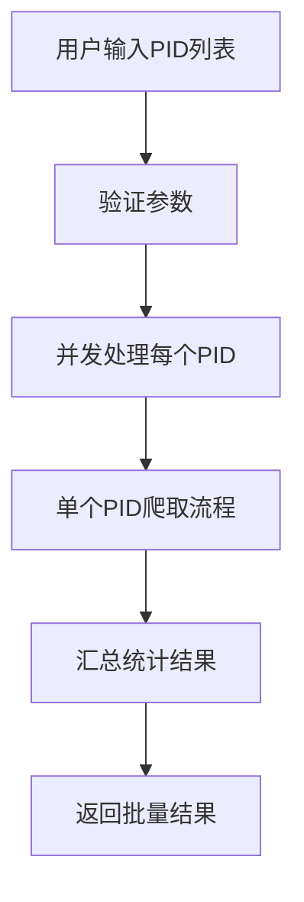
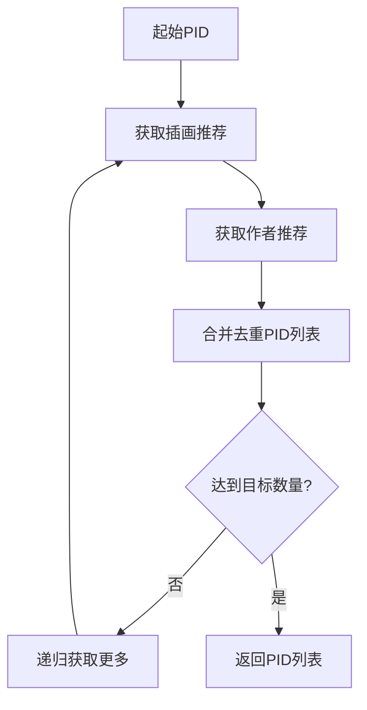

# Pixiv爬虫 Serverless 项目架构文档

## 📋 目录

- [项目概述](#项目概述)
- [技术架构](#技术架构)
- [核心组件](#核心组件)
- [数据流程](#数据流程)
- [详细实现](#详细实现)
- [部署架构](#部署架构)
- [性能优化](#性能优化)
- [安全机制](#安全机制)

## 🎯 项目概述

### 项目定位
这是一个基于 **Serverless 架构** 的 Pixiv 插画爬虫系统，采用 TypeScript 开发，使用 Supabase 作为数据库，部署在 Vercel 平台上。

### 核心功能
- 🕷️ **智能爬虫**: 基于推荐算法的递归爬取
- 📊 **热度计算**: 多维度图片质量评估
- 🔄 **防封机制**: 多Header轮换和请求延迟
- 🗄️ **数据管理**: PostgreSQL数据库存储和统计
- 🌐 **Web界面**: 实时监控和任务管理

### 技术特色
- **无服务器**: 零运维成本，按需扩容
- **类型安全**: 完整的 TypeScript 类型系统
- **实时同步**: Supabase 实时数据库
- **智能推荐**: 基于 Pixiv 官方推荐算法

## 🏗️ 技术架构

### 整体架构图

```
┌─────────────────┐    ┌─────────────────┐    ┌─────────────────┐
│   前端界面      │    │   Vercel        │    │   Supabase      │
│   (Web UI)      │◄──►│   Serverless    │◄──►│   PostgreSQL    │
│                 │    │   Functions     │    │   Database      │
└─────────────────┘    └─────────────────┘    └─────────────────┘
                              │
                              ▼
                       ┌─────────────────┐
                       │   Pixiv API     │
                       │   (爬取目标)    │
                       └─────────────────┘
```

### 技术栈

#### 后端技术
- **运行时**: Node.js 20+
- **语言**: TypeScript 5.2+
- **框架**: Vercel Functions
- **HTTP客户端**: Axios 1.6+
- **HTML解析**: Cheerio 1.0+

#### 数据库
- **主数据库**: Supabase (PostgreSQL)
- **ORM**: Supabase Client SDK
- **缓存**: 内存日志缓存

#### 部署平台
- **托管**: Vercel Serverless
- **构建**: TypeScript Compiler
- **CI/CD**: Vercel 自动部署

## 🧩 核心组件

### 1. 入口层 (`src/index.ts`)

```typescript
/**
 * Vercel Serverless 函数入口点
 * 负责请求路由、日志管理和响应处理
 */
export default async function handler(req: VercelRequest, res: VercelResponse)
```

**主要职责**:
- HTTP 请求路由分发
- 全局日志管理
- 错误处理和响应格式化
- 静态资源服务

### 2. 爬虫服务层 (`src/services/pixiv-crawler.ts`)

```typescript
/**
 * Pixiv 爬虫核心服务类
 * 实现智能推荐爬取和数据处理
 */
export class PixivCrawler
```

**核心方法**:
- `getPidsFromOriginPid()`: 基于起始PID的递归推荐爬取
- `getIllustInfo()`: 获取插画详细信息
- `reGetIllust()`: 递归获取推荐插画列表
- `batchCrawl()`: 批量爬取处理

### 3. 数据访问层 (`src/database/supabase.ts`)

```typescript
/**
 * Supabase 数据库服务类
 * 封装所有数据库操作
 */
export class SupabaseService
```

**数据操作**:
- `createPic()`: 创建图片记录
- `getPicByPid()`: 根据PID查询图片
- `updatePic()`: 更新图片信息
- `getTotalPicsCount()`: 统计查询

### 4. 工具函数层 (`src/utils/pixiv-utils.ts`)

**核心算法**:
```typescript
/**
 * 计算图片热度评分
 * 算法: (点赞数 * 0.55 + 收藏数 * 0.45) / 浏览量
 */
export function getIllustPopularity(infoJson: PixivIllustInfo): number
```

### 5. 配置管理 (`src/config/index.ts`)

**环境配置**:
- Pixiv API Headers 配置
- 爬虫参数配置
- 标签过滤配置

## 🔄 数据流程

### 1. 单个PID爬取流程



### 2. 批量爬取流程



### 3. 推荐算法流程



## 🔧 详细实现

### 1. 热度计算算法

```typescript
/**
 * 热度计算公式详解
 * 
 * 基础公式: popularity = (like * 0.55 + bookmark * 0.45) / view
 * 
 * 权重说明:
 * - 点赞权重: 55% (反映用户喜好)
 * - 收藏权重: 45% (反映内容质量)
 * - 浏览量作为分母 (标准化处理)
 * 
 * 低浏览量惩罚:
 * - 当浏览量 < 5000 时，按比例降低热度
 * - 避免新发布作品虚高评分
 */
export function getIllustPopularity(infoJson: PixivIllustInfo): number {
  const like = infoJson.body.likeCount;
  const bookmark = infoJson.body.bookmarkCount;
  const view = infoJson.body.viewCount;
  
  let popularity = (like * 0.55 + bookmark * 0.45) / view;
  
  // 低浏览量惩罚机制
  if (view < 5000) {
    popularity = popularity * (view / 5000);
  }
  
  return popularity;
}
```

### 2. 防封机制实现

```typescript
/**
 * 多层防封策略
 */
class PixivCrawler {
  private requestCount = 0;
  private currentHeaderIndex = 0;
  private readonly maxRequestsPerHeader = 300;
  
  /**
   * 请求头轮换机制
   * 每300次请求切换一次Header，避免单一身份被识别
   */
  private rotateHeaders(): void {
    if (this.requestCount >= this.maxRequestsPerHeader) {
      this.currentHeaderIndex = (this.currentHeaderIndex + 1) % this.headers.length;
      this.requestCount = 0;
    }
  }
  
  /**
   * 随机延迟机制
   * 模拟人工操作，避免请求过于规律
   */
  private async randomDelay(): Promise<void> {
    const delay = Math.random() * 1000; // 0-1秒随机延迟
    await new Promise(resolve => setTimeout(resolve, delay));
  }
}
```

### 3. 错误处理机制

```typescript
/**
 * 分层错误处理策略
 */
try {
  await this.supabase.createPic(picData);
  successCount++;
} catch (error: any) {
  // 智能错误识别
  if (error?.code === '23505' || error?.message?.includes('duplicate')) {
    // 重复键错误 - 友好提示
    logManager.addLog(`PID ${pid} 已存在于数据库中，跳过重复插入`, 'info', taskId);
    continue; // 不计入失败数
  } else {
    // 其他错误 - 详细记录
    const errorMsg = error?.message || error?.toString() || '未知错误';
    logManager.addLog(`处理pid:${pid}处理异常:${errorMsg}，已自动跳过`, 'error', taskId);
    failedCount++;
  }
}
```

### 4. 数据库设计

#### 主表结构 (`pic`)

```sql
CREATE TABLE pic (
    pid VARCHAR(255) PRIMARY KEY,           -- Pixiv作品ID
    download_time VARCHAR(255),             -- 下载时间
    tag TEXT,                              -- 标签列表(JSON格式)
    good INTEGER,                          -- 点赞数
    star INTEGER,                          -- 收藏数
    view INTEGER,                          -- 浏览数
    image_path VARCHAR(255),               -- 本地图片路径
    image_url VARCHAR(255),                -- 原始图片URL
    popularity DECIMAL(10,4),              -- 热度评分
    upload_time VARCHAR(255),              -- 上传时间
    wx_url VARCHAR(255),                   -- 微信图片URL
    wx_name VARCHAR(255),                  -- 微信文件名
    unfit BOOLEAN DEFAULT FALSE,           -- 是否不适宜
    created_at TIMESTAMP WITH TIME ZONE DEFAULT NOW(),
    updated_at TIMESTAMP WITH TIME ZONE DEFAULT NOW()
);
```

#### 索引优化

```sql
-- 性能优化索引
CREATE INDEX idx_pic_popularity ON pic(popularity DESC);  -- 热度排序
CREATE INDEX idx_pic_tags ON pic USING GIN(to_tsvector('english', tag)); -- 全文搜索
CREATE INDEX idx_pic_download_time ON pic(download_time); -- 时间查询
```

#### 统计视图

```sql
-- 实时统计视图
CREATE VIEW pic_stats AS
SELECT 
    COUNT(*) as total_pics,                                    -- 总图片数
    COUNT(CASE WHEN image_path IS NOT NULL THEN 1 END) as downloaded_pics, -- 已下载数
    AVG(popularity) as avg_popularity,                         -- 平均热度
    MAX(popularity) as max_popularity,                         -- 最高热度
    MIN(popularity) as min_popularity                          -- 最低热度
FROM pic;
```

## 🚀 部署架构

### Vercel 部署配置

```json
{
  "version": 2,
  "buildCommand": "npm run build",
  "functions": {
    "api/index.js": {
      "maxDuration": 300
    }
  }
}
```

### 环境变量配置

```bash
# Supabase 数据库配置
SUPABASE_URL=your_supabase_url
SUPABASE_ANON_KEY=your_supabase_anon_key
SUPABASE_SERVICE_ROLE_KEY=your_supabase_service_role_key

# Pixiv API 配置
PIXIV_USER_AGENT=Mozilla/5.0 (Windows NT 10.0; Win64; x64; rv:131.0) Gecko/20100101 Firefox/131.0
PIXIV_COOKIE=your_pixiv_cookie
PIXIV_REFERER=https://www.pixiv.net/artworks/112388359

# 爬虫参数配置
MAX_ILLUSTRATIONS=1000
POPULARITY_THRESHOLD=0.22
REQUEST_DELAY_MIN=0
REQUEST_DELAY_MAX=1000
MAX_REQUESTS_PER_HEADER=300
```

### 构建流程

```bash
# 1. 依赖安装
npm install

# 2. TypeScript 编译
npm run build

# 3. 部署到 Vercel
npm run deploy
```

## ⚡ 性能优化

### 1. 并发控制

```typescript
/**
 * 批量处理优化
 * 使用 Promise.all 并发处理多个PID
 */
async batchCrawl(pids: string[], targetNum: number, popularityThreshold: number, taskId: string) {
  const promises = pids.map(pid => 
    this.getPidsFromOriginPid(pid, targetNum, popularityThreshold, taskId)
  );
  
  const results = await Promise.allSettled(promises);
  return this.aggregateResults(results);
}
```

### 2. 内存优化

```typescript
/**
 * 日志管理优化
 * 限制内存中日志数量，防止内存泄漏
 */
class LogManager {
  private logs: LogEntry[] = [];
  private readonly maxLogs = 1000;
  
  addLog(message: string, type: LogType, taskId?: string): void {
    this.logs.push({ id: Date.now().toString(), timestamp: new Date().toISOString(), message, type, taskId });
    
    // 保持日志数量在限制内
    if (this.logs.length > this.maxLogs) {
      this.logs = this.logs.slice(-this.maxLogs);
    }
  }
}
```

### 3. 数据库优化

- **连接池**: Supabase 自动管理连接池
- **索引优化**: 针对查询模式创建合适索引
- **批量操作**: 使用事务处理批量插入
- **查询优化**: 使用视图预计算统计数据

## 🔒 安全机制

### 1. 环境变量保护

```typescript
/**
 * 敏感信息检查
 * 确保所有必要的环境变量都已配置
 */
function validateEnvironment(): { valid: boolean; missing: string[] } {
  const required = ['SUPABASE_URL', 'SUPABASE_ANON_KEY', 'PIXIV_COOKIE'];
  const missing = required.filter(key => !process.env[key]);
  
  return {
    valid: missing.length === 0,
    missing
  };
}
```

### 2. 输入验证

```typescript
/**
 * 参数验证中间件
 * 防止恶意输入和参数注入
 */
function validateCrawlerParams(targetNum: number, popularityThreshold: number): boolean {
  return targetNum > 0 && 
         targetNum <= 1000 && 
         popularityThreshold >= 0 && 
         popularityThreshold <= 1;
}
```

### 3. 错误信息脱敏

```typescript
/**
 * 错误信息处理
 * 避免泄露敏感的系统信息
 */
function sanitizeError(error: any): string {
  if (typeof error === 'string') return error;
  if (error?.message) return error.message;
  return '系统内部错误';
}
```

## 📊 监控和日志

### 1. 实时日志系统

```typescript
/**
 * 分级日志系统
 * 支持不同级别的日志记录和过滤
 */
interface LogEntry {
  id: string;
  timestamp: string;
  message: string;
  type: 'info' | 'error' | 'warning' | 'success';
  taskId?: string;
}
```

### 2. 性能监控

- **请求计数**: 跟踪API调用频率
- **成功率统计**: 监控爬取成功率
- **响应时间**: 记录处理耗时
- **错误率**: 统计各类错误发生频率

### 3. 业务指标

- **图片质量分布**: 热度评分统计
- **标签分析**: 热门标签统计
- **用户行为**: 爬取模式分析

## 🔮 扩展性设计

### 1. 模块化架构

- **服务层分离**: 爬虫、数据库、配置独立
- **接口抽象**: 便于替换不同的实现
- **插件机制**: 支持自定义处理器

### 2. 配置驱动

- **动态配置**: 支持运行时配置更新
- **多环境支持**: 开发、测试、生产环境隔离
- **特性开关**: 功能开关控制

### 3. 水平扩展

- **无状态设计**: 支持多实例部署
- **数据库分片**: 支持数据水平分割
- **缓存层**: 支持 Redis 等外部缓存

---

## 📝 总结

这个 Pixiv 爬虫项目采用了现代化的 Serverless 架构，具有以下特点：

1. **高可用性**: Vercel 平台保证 99.9% 可用性
2. **自动扩容**: 根据请求量自动调整资源
3. **成本优化**: 按使用量付费，无闲置成本
4. **开发效率**: TypeScript 提供完整类型安全
5. **数据安全**: Supabase 提供企业级数据保护

通过合理的架构设计和优化策略，系统能够稳定高效地处理大规模的图片爬取任务，同时保持良好的用户体验和系统可维护性。